# Design: Secure Bio Page API

## Approach and Priorities

This take-home is explicitly not about completeness — it's about demonstrating how I think about security, tradeoffs, and implementation choices. I treated it that way.

**What I prioritized:**

The highest-impact security work is authentication and access control enforcement. A system that leaks or allows unauthorized modification of user data is fundamentally broken regardless of how polished the rest of it is. So I focused on:

1. Getting the auth flow correct end-to-end (signup → JWT → protected routes)
2. Making sure authorization is enforced at the framework level via guards, not scattered in service logic
3. Handling the subtle security details that are easy to miss — timing-safe login, password never in JWT, secure-by-default routing

**What I consciously deferred and why:**

- **Rate limiting** on auth endpoints — meaningful protection, but requires `@nestjs/throttler` wiring. Wanted time on the core access control model first.
- **Refresh tokens / revocation** — JWTs can't be revoked without a token store. For a time-boxed exercise with an in-memory DB, 24h tokens are an acceptable tradeoff.
- **Read-only share tier** — the schema supports it (one column addition), but implementing the guard distinction would have consumed time better spent on the ownership model.
- **Email verification** — not the security focus of this exercise.

---

## 1. System Overview

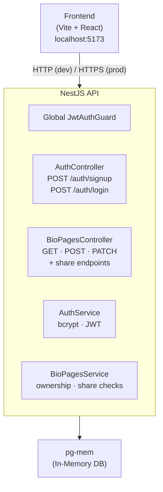

---

## 2. Threat Model

### Assets and Threat Actors

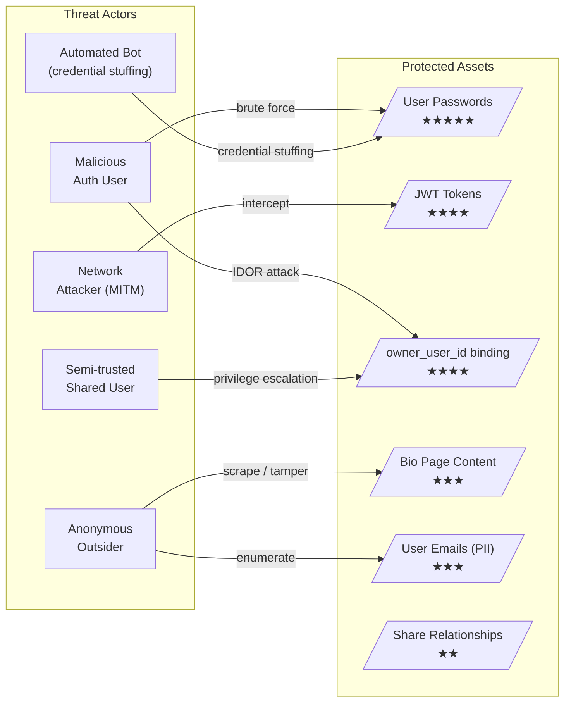

### STRIDE Threat Map

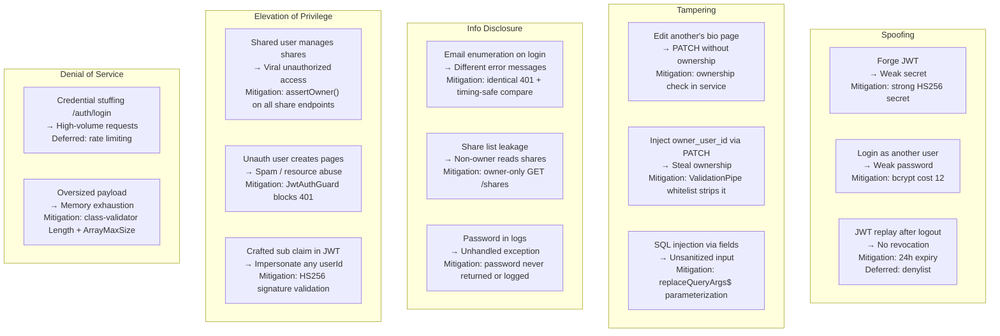

### Trust Boundaries

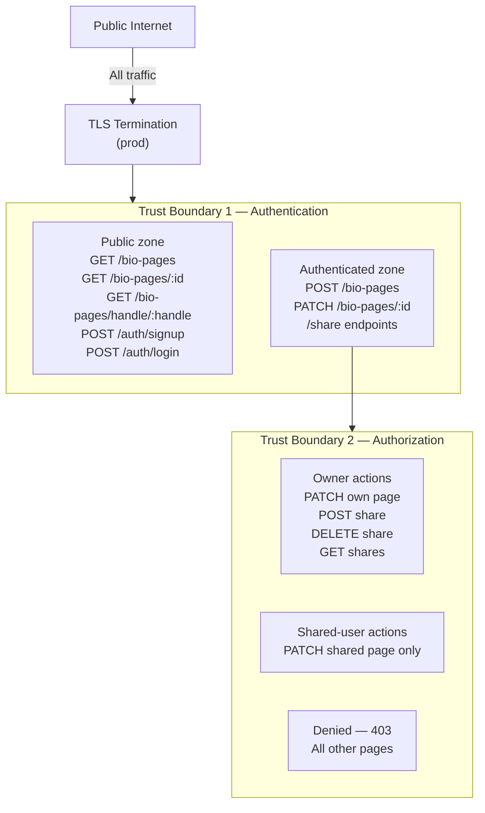

---

## 3. Authentication Flows

### Signup

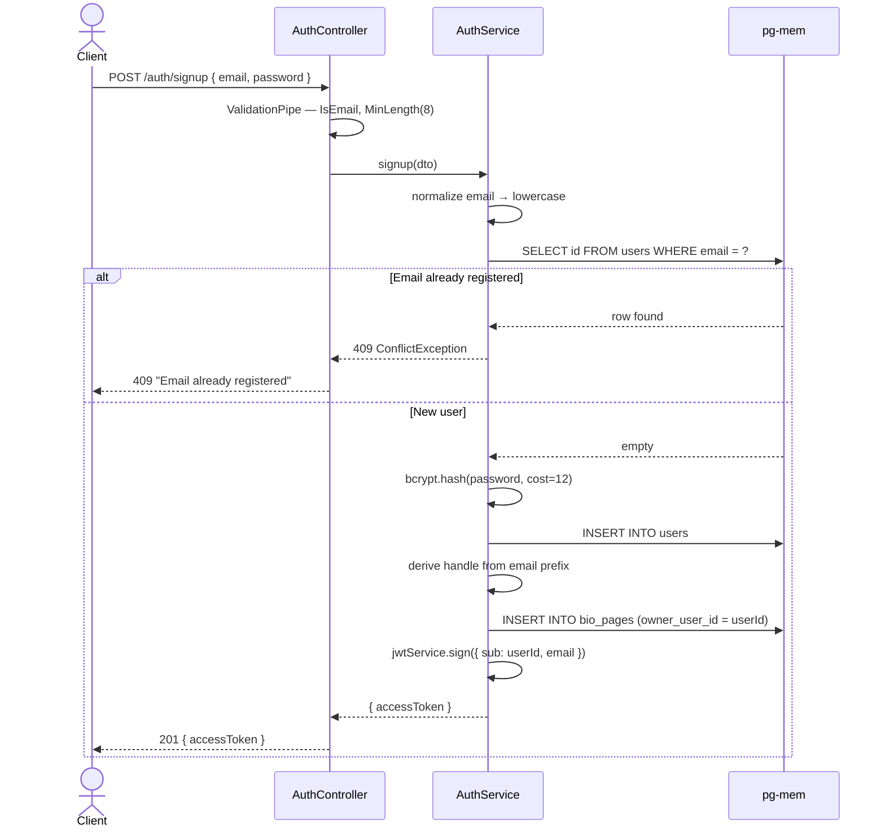

### Login (with timing-safe protection)

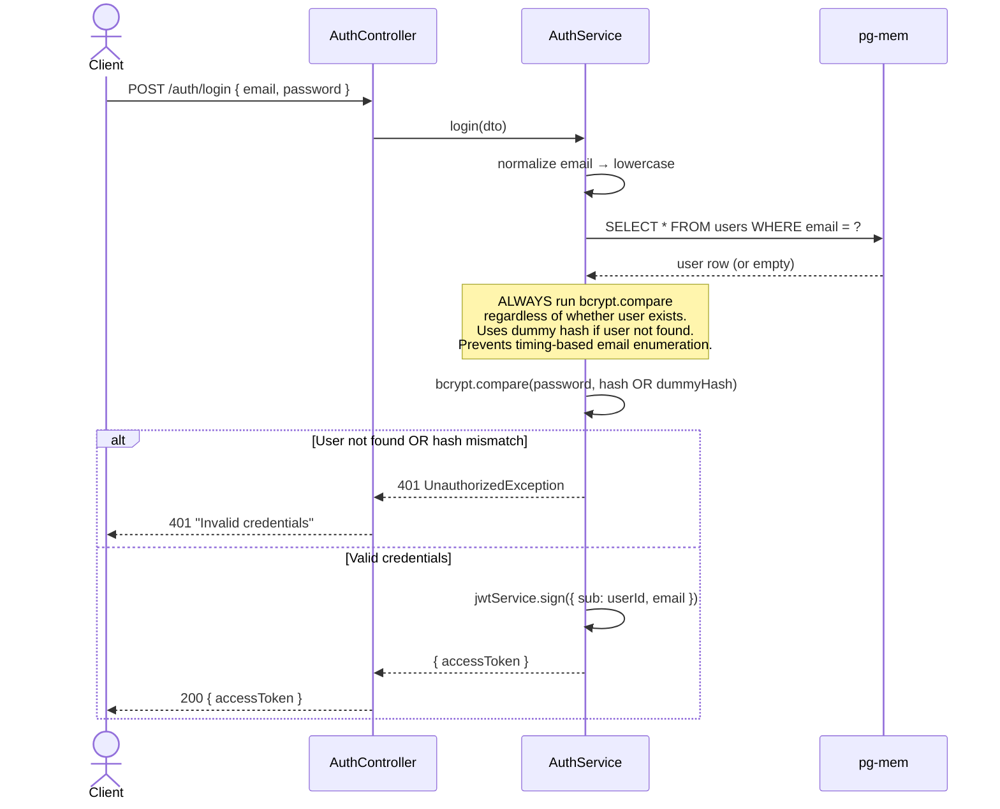

---

## 4. Authorization Flows

### PATCH /bio-pages/:id — Access Decision

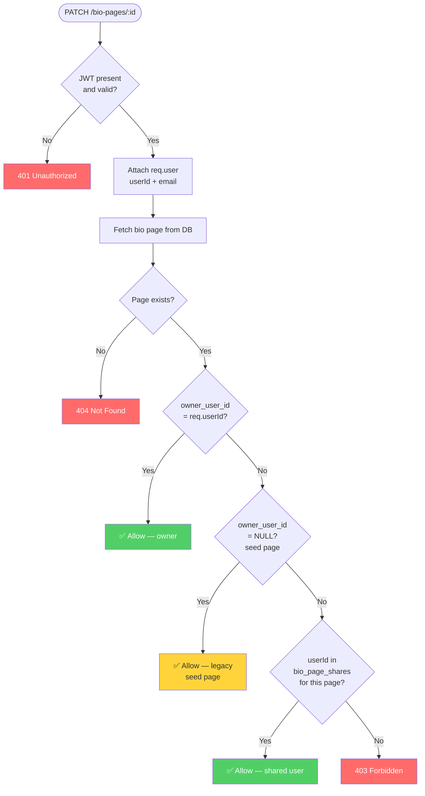

### Share Grant Flow

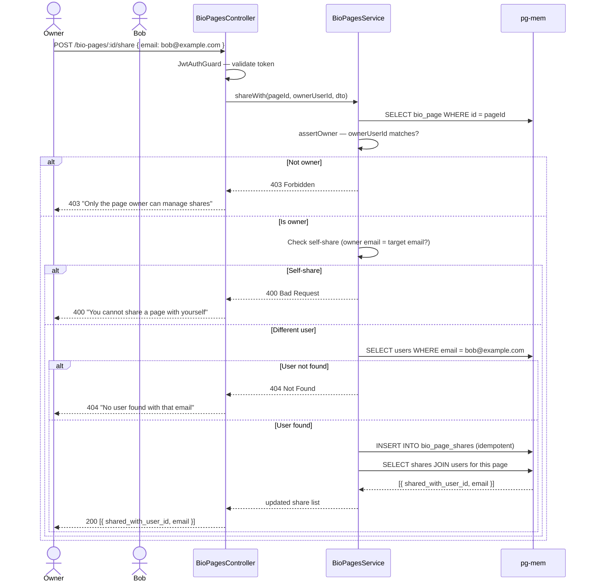

### Share Revoke Flow

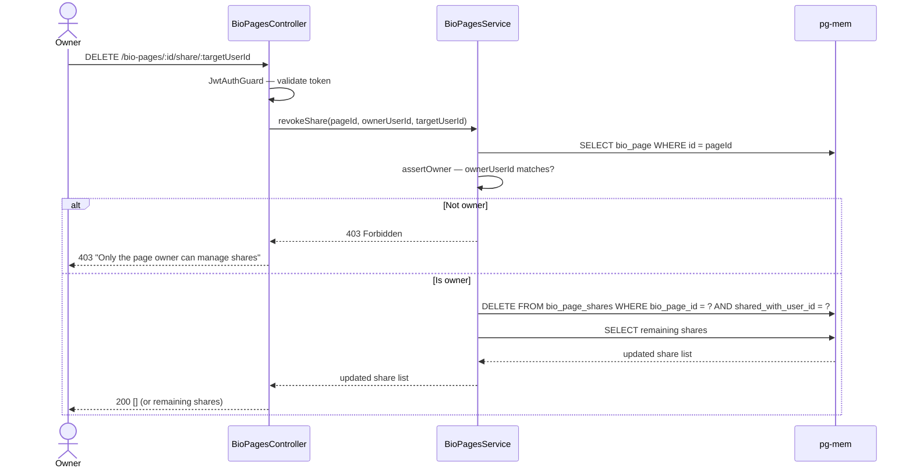

---

## 5. Database Schema

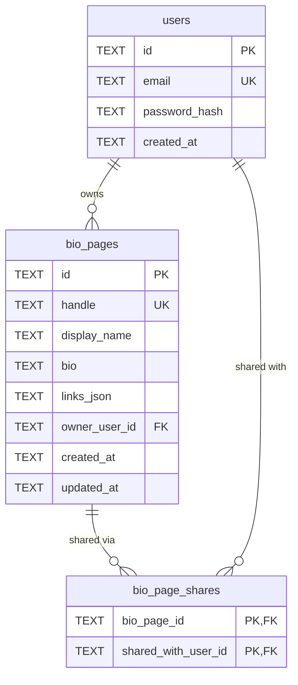

---

## 6. Module Structure

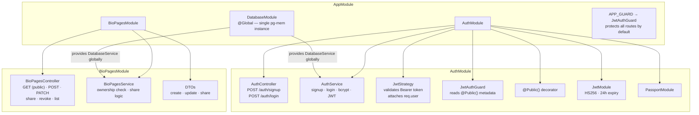

---

## 7. Permission Matrix

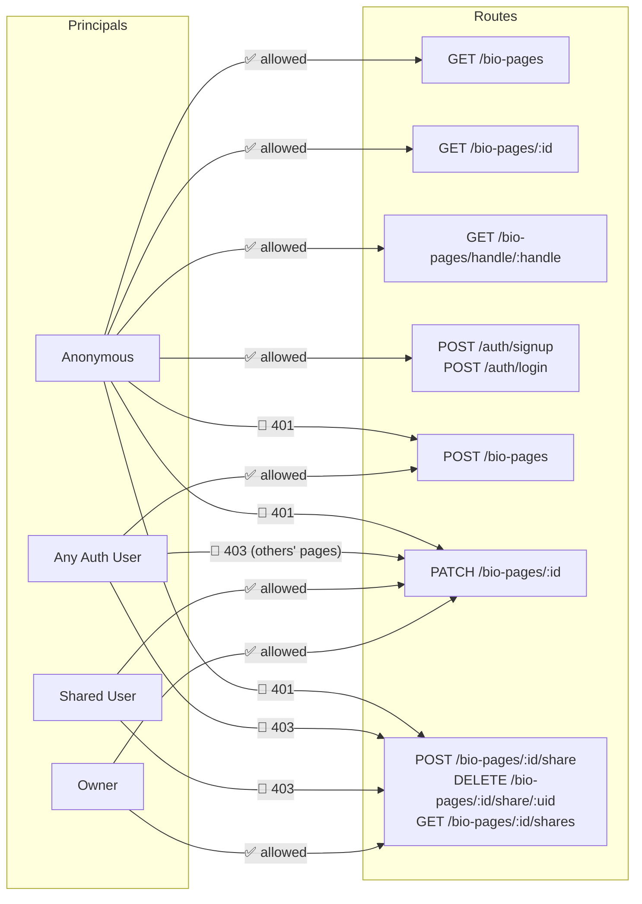

---

## 8. Password Security

- **Algorithm:** bcrypt, cost factor 12 (~250ms per hash on modern hardware — slow enough to resist brute force, fast enough for UX)
- **Never stored or logged in plaintext** — hashed immediately in `AuthService`, raw string never persisted or returned
- **Not in JWT payload** — token contains only `userId` and `email`
- **Timing-safe login** — `bcrypt.compare` always runs even when the user does not exist, using a dummy hash. Prevents distinguishing "wrong email" from "wrong password" via response timing

---

## 9. Tradeoffs and Assumptions

### Assumptions

- **One bio page auto-created at signup.** A user can create additional pages via `POST /bio-pages`; there is no hard one-per-user limit beyond the auto-creation.
- **Sharing is edit-sharing only.** Public read is already open; a read-only grant between users adds no value without private pages first.
- **Sharing by email.** Users must know each other's email. Mirrors real collaboration tools; avoids exposing a user directory endpoint.
- **Seed rows are ownerless.** Three seeded pages have `owner_user_id = NULL` and are editable by any authenticated user for demo purposes. In production they would have real owners or be removed.
- **`JWT_SECRET` has a dev fallback.** Must be overridden via environment variable in production. A startup check (`if (!process.env.JWT_SECRET) throw`) would be added with more time.

### Tradeoffs

| Decision | Alternative | Reasoning |
|---|---|---|
| JWT (stateless) | Sessions + Redis | No persistent store — pg-mem is in-memory by design |
| bcrypt cost 12 | Argon2id | bcrypt simpler; Argon2id preferable for new production systems — noted as future work |
| HS256 | RS256 | Single-service app; asymmetric keys add operational complexity with no benefit here |
| Share by email | Share by user ID | More ergonomic; adds one lookup query, worth it |
| Global guard + `@Public()` opt-out | Per-route opt-in | Secure by default — new routes blocked unless explicitly opened |
| 24h expiry, no refresh | Short expiry + refresh tokens | Refresh tokens require a server-side store, contradicts in-memory DB constraint |
| Ownership check in service | Dedicated guard class | Service already fetches the page; co-location avoids a redundant DB query |

---

## 10. What Would Be Added With More Time

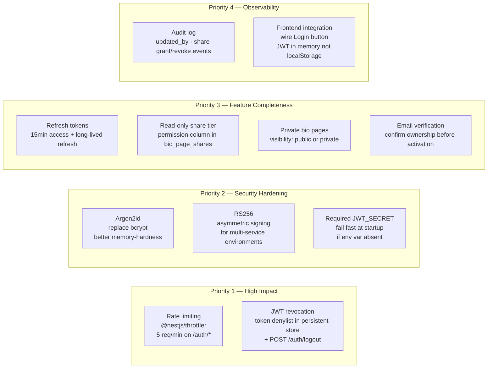

---

## 11. API Error Reference

| Situation | HTTP | Message |
|---|---|---|
| Missing or invalid JWT | 401 | Unauthorized |
| Wrong email or password | 401 | "Invalid credentials" (same for both — by design) |
| Not owner, not shared | 403 | "You do not have permission to edit this bio page" |
| Non-owner accessing shares | 403 | "Only the page owner can manage shares" |
| Resource not found | 404 | "Bio page not found" / "No user found with that email" |
| Handle conflict | 409 | "Handle already exists" |
| Validation failure | 400 | Field-level details from class-validator |
| Self-share | 400 | "You cannot share a page with yourself" |
| Email already registered | 409 | "Email already registered" |
